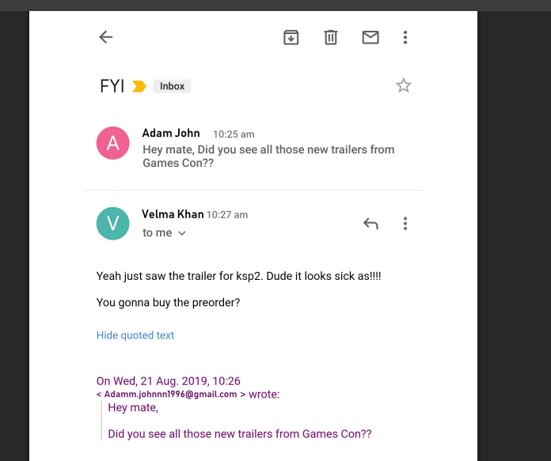
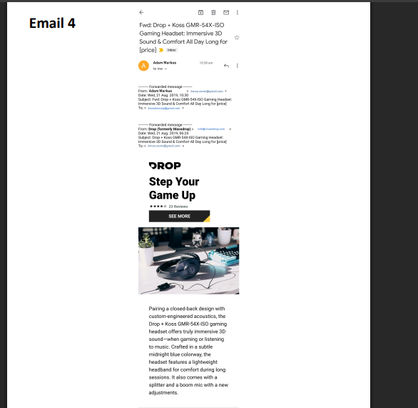
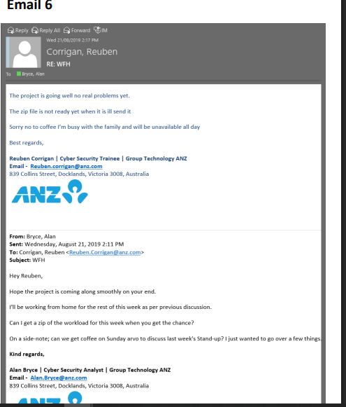
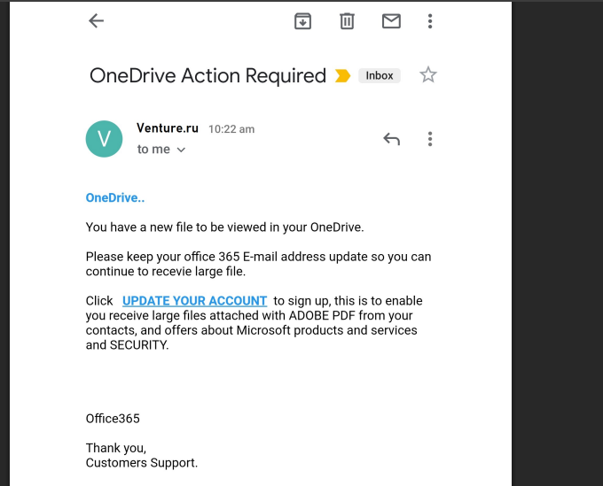
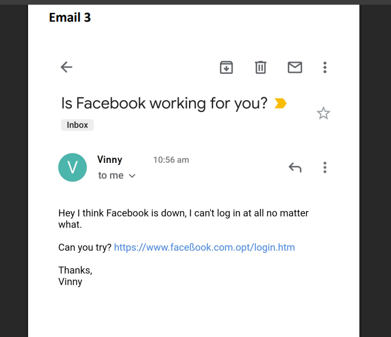
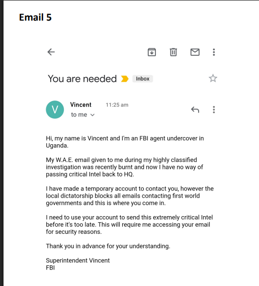

# FUTURE_CS_02 (Phishing Email Detection & Awareness)

#  PhishGuard-Awareness — Phishing Detection & Awareness Report

> **Future Interns Cybersecurity Programme**
> Prepared by: **Cleveland Henry** 

---

## Introduction

Phishing is one of the most pervasive and dangerous forms of cybercrime, targeting individuals and organizations by exploiting human trust rather than technical vulnerabilities. It typically involves fraudulent emails, messages, or websites designed to impersonate legitimate brands or trusted contacts, with the goal of stealing sensitive information such as passwords, financial details, or personal data.

Phishing attacks often use social engineering techniques—urgency, authority, exclusivity, or fear—to manipulate recipients into taking unsafe actions, like clicking on malicious links, downloading harmful attachments, or divulging confidential credentials. Despite advances in technical security measures, phishing remains highly effective because it preys on human psychology.

This project analyzes real-world email samples to identify phishing indicators, such as spoofed domains, lookalike URLs, grammatical inconsistencies, and suspicious calls to action. It aims to provide practical guidance, tools, and awareness strategies to help individuals and organizations recognize, avoid, and report phishing attempts.

By understanding the tactics used by attackers and adopting simple yet effective preventive measures, users can significantly reduce the risk of falling victim to phishing scams.

##  Overview

This repository contains a professional **Phishing Detection & Awareness Report** produced as part of the Future Interns Cybersecurity Internship Programme (Task 2). Unlike reports using synthetic examples, **this analysis is based on 7 real email screenshots** collected from live inboxes — making the findings directly applicable to real-world threat scenarios.

---

## Key Features
1. Identify phishing indicatiors (spoofed sender, fake domains, malicious links)
2. Classify emails as safe/suspicious/phishing
3. Explain phishing techniques in simple business friendly language
4. Provide clear prevention and awareness guidelines for users

---

##  Sample Classifications

| # | Subject | Sender | Classification | Risk |
|---|---------|--------|----------------|------|
| 1 | FYI (Games Con Discussion) | Adam John (Gmail) |  SAFE | None |
| 2 | OneDrive Action Required | **Venture.ru** | PHISHING | CRITICAL |
| 3 | Is Facebook Working For You? | Vinny (anon) |  PHISHING | CRITICAL |
| 4 | Drop Gaming Headset | Drop (drop.com) |  SAFE | None |
| 5 | You Are Needed | Vincent (anon) |  SCAM | CRITICAL |
| 6 | RE: WFH | Reuben.corrigan@anz.com |  SAFE | None |
| 7 | Geico Insurance Offer | **Val.kill.ma** |  PHISHING | CRITICAL |

**Result: 4 malicious / 3 legitimate**

---

## Legitimate emails (3)

*Out of the seven samples analyzed, three were verified as legitimate. These emails shared clear traits of authenticity: verified sender domains, expected content, professional formatting, and no requests for credentials. Recognizing a legitimate email often involves checking that the sender matches the official domain, the links point to trusted websites, and the message aligns with normal communication patterns.*

***Email 1***

***Email 4***

***Email 6***

---

##  Key Phishing Techniques Identified (4 malicious emails)

*The remaining four emails were identified as phishing or scams. They used tactics like spoofed domains, lookalike URLs, social engineering narratives, and brand impersonation. These emails often create urgency, request sensitive information, or use suspicious links to steal credentials. Awareness of these red flags helps users avoid falling victim to such attacks.*

***Email 2***

* Domain spoofing (non-Microsoft sender claiming OneDrive)*

***Email 3***

*Lookalike URL (faceBook.com.opt — non-existent TLD)*

***Email 5***

*Social engineering narrative (fake FBI agent)*

***Email 7***

* Brand impersonation + obfuscated URL (Geico / urlif.y)*
  

---

##  Tools Used

| Tool | Purpose |
|------|---------|
| Google Admin Toolbox | Email header parsing, SPF/DKIM/DMARC evaluation |
| MXToolbox | Header visualization and authentication |
| VirusTotal | URL and domain reputation analysis |
| WHOIS / DomainTools | Domain registration age lookup |
| IANA TLD Registry | TLD legitimacy verification |
| Phishing.Database | Cross-reference against known phishing domains |

---

## Analysis Methodology

1. Screenshot collection from real inbox samples
2. Visual triage: sender, subject, body inspection
3. Header analysis: SPF, DKIM, DMARC, Return-Path
4. Domain/URL decomposition and TLD validation
5. Threat intelligence cross-referencing
6. Classification against three-tier risk model
7. Full indicator documentation with severity ratings

---

> Malicious URLs are displayed in defanged format (hxxp, [.]) throughout the report.

---
## 10 Essential Guidelines to Avoid Phishing Attacks

1. Verify the Sender Domain – Always hover over the sender’s email to check the full domain; ensure it matches the official organization (e.g., @microsoft.com, not @venture.ru).
2. Check Every Link – Hover over hyperlinks to confirm the destination URL; watch for lookalike tricks, extra subdomains, or unfamiliar TLDs.
3. Assess Email Context – Question whether the request is plausible; organizations rarely ask for passwords, sensitive info, or account access via email.
4. Enable Multi-Factor Authentication (MFA) – Protect accounts so stolen credentials alone cannot grant access.
5. Report Suspicious Emails – Use official IT or security channels to report any questionable email immediately.
6. Verify Through Separate Channels – Call or message the sender via a known, independent contact method before acting on sensitive requests.
7. Avoid Clicking Urgent or Threatening Links – Phishing often creates artificial urgency like “before it’s too late” to bypass rational thinking.
8. Inspect Attachments Carefully – Never open unexpected executables (.exe, .bat, .js) or attachments from unknown sources.
9. Check for Grammar and Brand Inconsistencies – Poor spelling, odd phrasing, or incorrect branding are strong phishing indicators.
10. Keep Systems Updated – Regularly update your OS, browser, and antivirus software to reduce exposure to malware delivered via phishing.
    
---
## Detailed Report

*For a full, detailed analysis of the phishing email samples and comprehensive prevention guidelines, please refer to the complete [report](report/Phishing_Detection_Awareness_Report.pdf)*

---

## Author

*Cleveland Henry Lore | Future Interns Cybersecurity Programme 2026*
